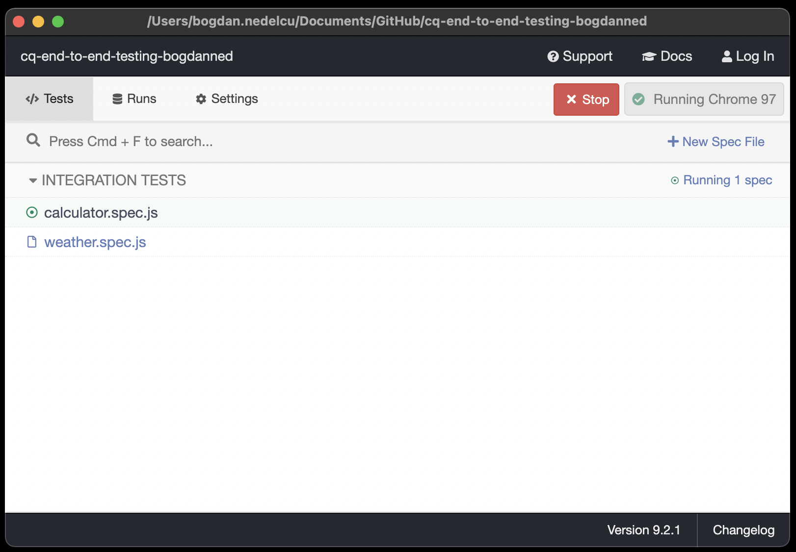
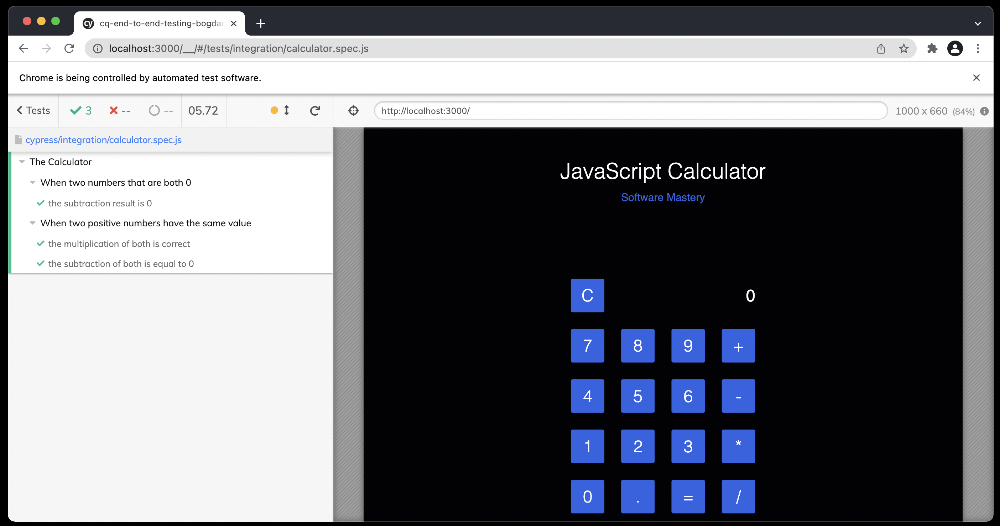

# Action Item: End to End Testing :ok_woman:
In this **Action Item**, you will:
- :rocket: use `Cypress` to write ` end to end` tests
- :nut_and_bolt: use the `AAA` pattern to structure your tests
- :ledger: use the `Given` > `When` > `Then` structure to write your test messages
------

### 1.`EASY` Write a simple end to end test using `Cypress`
With `Cypress` we can test the application just like a real user would do: click on buttons, type in input fields, scroll and so on. We can then write `expect` statements about what should appear on the screen.

##### 1.1 Install dependencies:
```bash
npm install
```
##### 1.2 Run the app:
```bash
npm start
```
And go to [localhost:3000](http://localhost:3000). You should see something like this:

##### 1.3 Run the tests:
To make the best out of your time, we have already set up `Cypress` in this repository, you can find out how in [CYPRESS_SETUP](CYPRESS_SETUP.md). 

In a new terminal window(the application must be running):
```bash
npm run cypress:open
```
###### :warning: If this is the first time you are running `Cypress`, this step will take should take longer.

You should see something like this:


Click on the `calculator.spec.js` button and a chrome window should open. You should see this:



##### 1.4 Complete the calculator tests

:construction:Check out the test file [calculator.spec.js](cypress/integration/calculator.spec.js).

##### TODO's:
- 📝Write test for `division` and `addition` of two numbers: `5 + 5 = 10`
- 📝 Write tests for compound operations like: `10 * 54 / 6 - 45 = 45` 


------

### 2.`HARD` Write a complex `end to end` test involving a `stub` for an API call

##### 2.1 Inspect the weather app
Go to [localhost:3000/weather](http://localhost:3000/weather). Type `Singapore` in the search bar and press `Enter`. You should see something like this:


:construction:Check out the test file [weather.spec.js](cypress/integration/weather.spec.js).

##### TODO's:
Write tests for the weather API:
- 📝Add `data-cy` selectors in the [weather.html](/public/weather.html) file for the search bar and the results containers
- 📝 Add a test where you look for a specific city: `Madrid` and assert you get back the right weather values
- 📝Use a `stub` for the API call using `cy.intercept`, See the [intercept docs here](https://docs.cypress.io/api/commands/intercept#Usage)
- 📝Use a `fixture` to store the response of the API call and have cleaner test files. See the [fixtures docs here](https://docs.cypress.io/api/commands/fixture)

Example of a stub with `cy.intercept`:
```javascript
// spying and response stubbing
cy.intercept('GET', 'https://api.openweathermap.org/data/2.5/*', {
  statusCode: 200,
  body: {
    "weather": [
        {
        "id": 804,
        "main": "Clouds",
        "description": "overcast clouds",
        "icon": "04n"
        }
    ],
    "main": {
        "temp": 20.61,
        "feels_like": 21.18,
        "temp_min": 19.53,
        "temp_max": 21.92,
        "pressure": 1019,
        "humidity": 94
    },
    "clouds": {
        "all": 100
    },
    "dt": 1642062602,
    "timezone": -10800,
    "id": 3448439,
    "name": "Madrid",
    "cod": 200
    }
})

```


------
